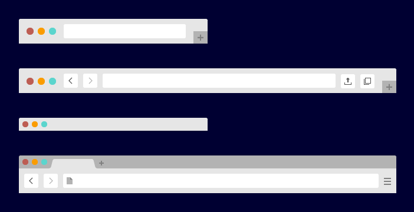
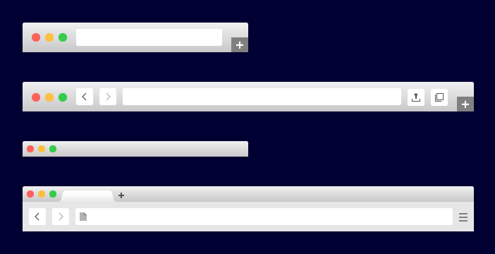
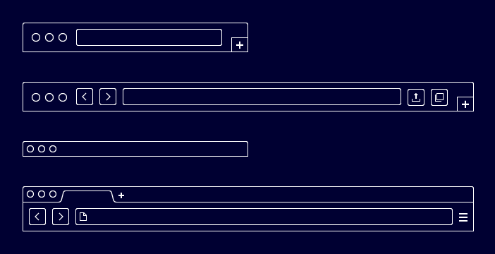

Simple-browser
==============

Simple browser UI for wireframes and mockups —for Illustrator (&amp; Sketch coming soon…)

# What is it?

Simple browser files contain graphic elements that you can use to put your wireframes or mockups in the context of a web browser.

# 3 Styles

The browser elements come in 3 differents style:

* A — Neutral (quite mainstream to be honest)
* B — Smooth (closer to Chrome or Firefox flavour)
* C — Ghost (skeleton lines)

Here is a preview of those 3 style

**Style A - Neutral** 

**Style B - Smooth**

**Style C - Ghost**

# Illustrator file

The Adobe Illustrator CC file contains the 3 styles.
The 6 artboards are regrouping:

* The graphic elements as source **vector shapes**
* The browser style as **symbols objects** (that you can resize to fit your mockups width)
* The color palette with global color (that you can tweak to adapt to your own visual design)

This file is composed of **3 layers**:

* Instructions (where you will find some extra information on how to use the elements)
* Elements (the sources elements and the symbols as well as the guides)
* Background (the dark blue color at the back)

# The Sketch file (coming soon…)

This file will contain hopefully the same content as the Illustrator one! Stay tuned…